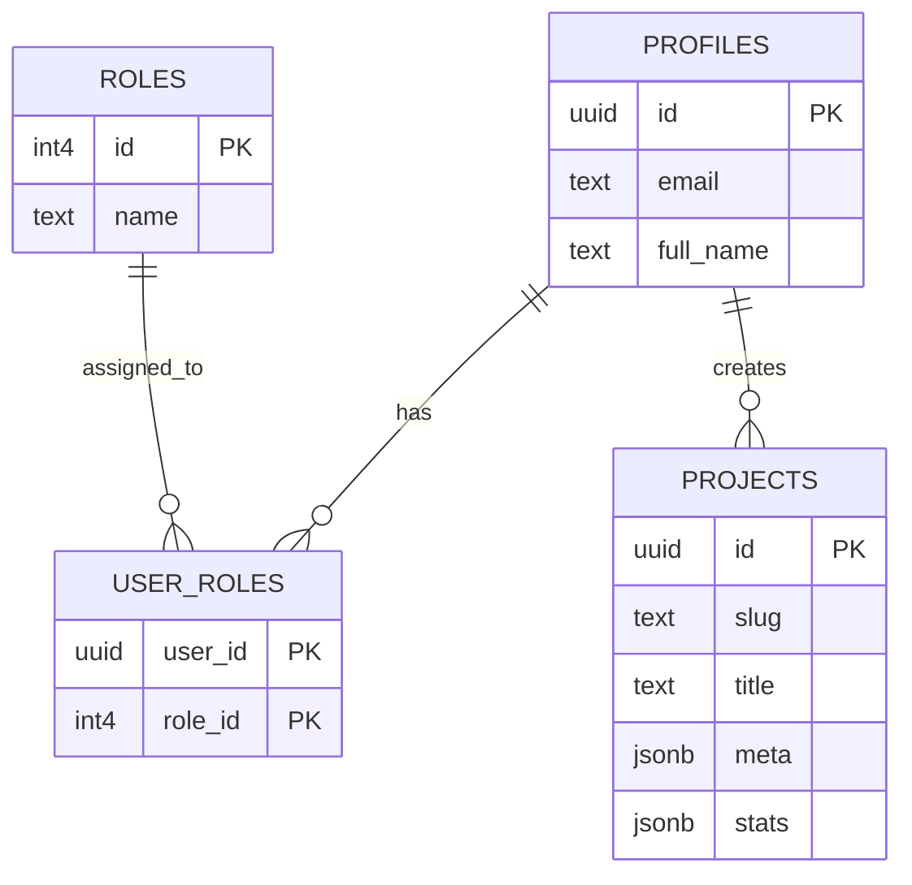

# Database Schema

Database menggunakan PostgreSQL yang di- *hosting* oleh Supabase dan diakses melalui **Transaction/Session Pooler** (menggunakan *driver* `pgxpool`).

## Table Relations

## Fitur Kunci
1. **UUIDv4**: Menggunakan UUID generasi ke-4 untuk menghindari tebakan ID yang sekuensial.
2. **JSONB**: Menggunakan format `jsonb` pada `meta` dan `stats` agar struktur portofolio bisa dinamis (misalnya, ada proyek yang tidak punya "*Techstack*" tapi punya "*Hardware*") tanpa perlu merombak *schema* kolom relasional secara terus-menerus.
3. **Cascading Deletes**: Jika sebuah akun (*Profile*) dihapus, semua kepemilikan *role* mereka di tabel `user_roles` akan otomatis terhapus untuk mencegah data yatim piatu (*orphaned records*).
